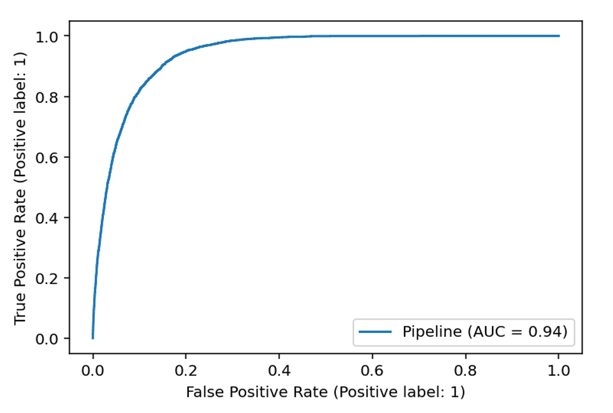

# To-Be_Challenge

[To-Be](https://duckduckgo.com) is a machine learning challenge on CodaLab Platform about Mortality Prediction. The challenge aims to adress the problems of medical imbalanced data classification.

I worked in a team of 3 to solve the challenge and we were able to achieve a score of 77% and rank in the top 3. We used a LGBMClassifier and a mix of two resampling techniques (RandomUnderSampler and BorderlineSMOTE).

 

# Results

